## SPIRAL_25 dataset
This is a tiny data set of the first 50 records (10 random hyper-parameter combinations at 5 epochs) from the [complete dataset of 10,000 rows](https://drive.google.com/uc?id=0Bz2L2qpV9PICRWtBYWY1VkFuZWs&export=download)) and for demonstration purpose only.

| file | description |
|----|----|
| input.txt | input data generated with spiral shape at noise 25%. seven features (X1, X2, X12, X22, X1X2, sin(X1), sin(X2)) and labels (ground truth) for 200 input points. The ratio of the training to test is a varying hyper-parameter |
| index.txt | values for the hyper-parameters used for each run and summary statistics. There are 5 rows per parameter combination correponding to 5 different epochs (25, 50, 100, 200, 400) |
| paramInfo.txt | information about each column of index.txt (hyper-parameters + output statistics)|
| runs/[i].txt | one file for each run: predicted labels the points at the i'th run |
| images/[i].png | one plot for each run output: predicted classification. training and test points are represented with white and black stroke respectively.|

The following images are the classification output plot for random hyper-parameters at different epochs.

| epoch: 25 | epoch: 50 | epoch: 100 | epoch: 200 | epoch: 400 |
|----|----|----|----|----|
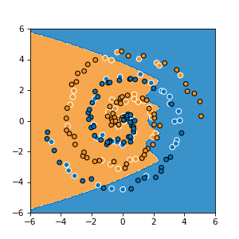||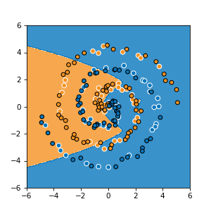||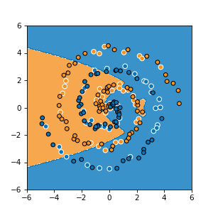|
|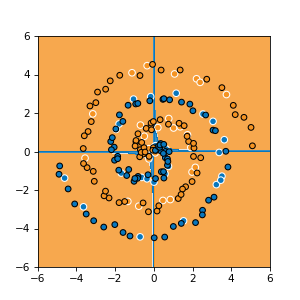||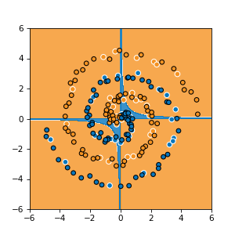|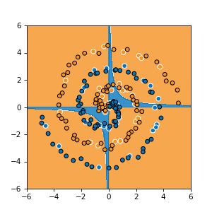|
||||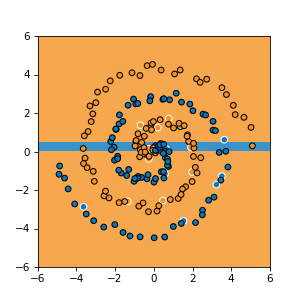|
|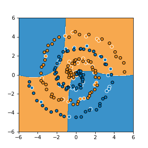||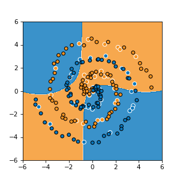||
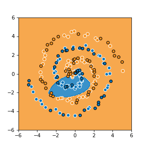|||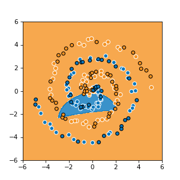|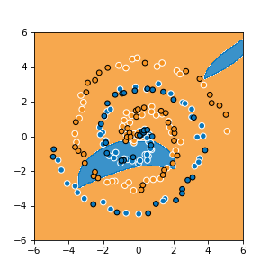|
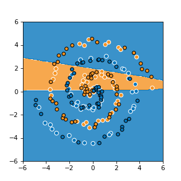|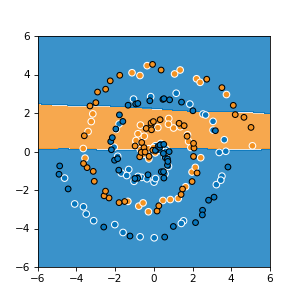|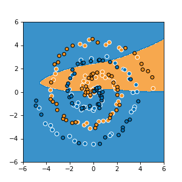|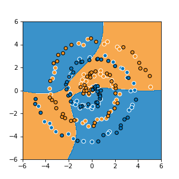|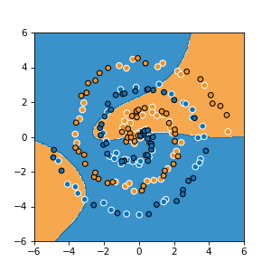|
||||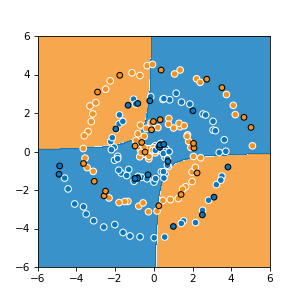|
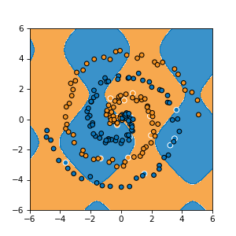||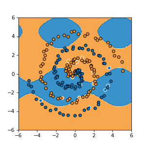|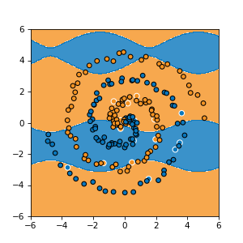|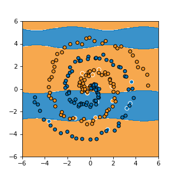|
||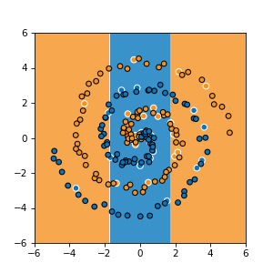|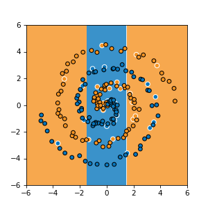|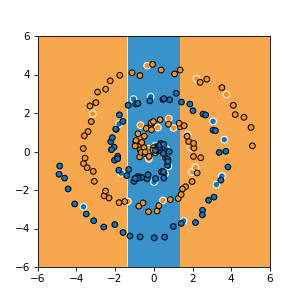|
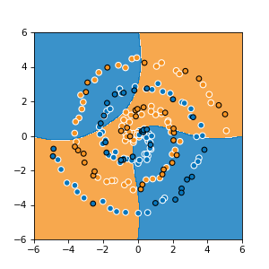||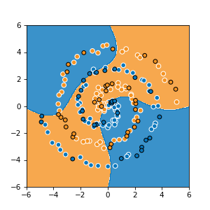||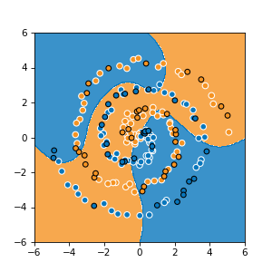|
